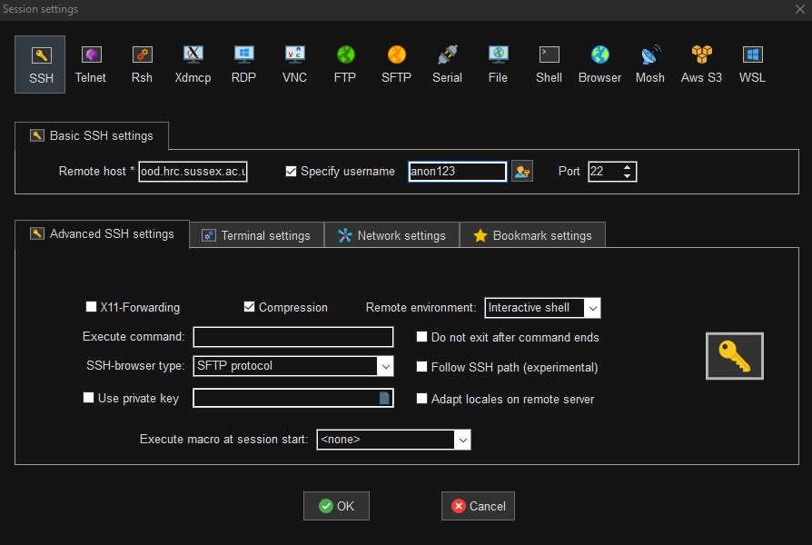
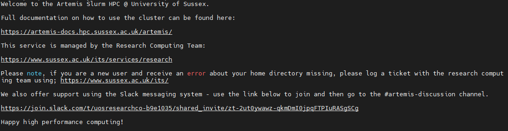

<div id="top"></div>

<!-- PROJECT SHIELDS -->
<!--
*** I'm using markdown "reference style" links for readability.
*** Reference links are enclosed in brackets [ ] instead of parentheses ( ).
*** See the bottom of this document for the declaration of the reference variables
*** for contributors-url, forks-url, etc. This is an optional, concise syntax you may use.

[](https://github.com/universityofsussex-its/RC-Workshops/graphs/contributors)
[](https://github.com/universityofsussex-its/RC-Workshops/network/members)
[![Stargazers][stars-shield]][stars-url]
[](https://github.com/universityofsussex-its/RC-Workshops/issues)


<!-- PROJECT LOGO -->

<div align="center">
  <a href="https://universityofsussex-rc.github.io/Workshops/">
    
  </a>

  <h3 align="center">Basic Exercises #1</h3>
  <p align="center">
    This first set of exercise will introduce you to navigating around the HPC, from your Home directory to storage systems, creating a bash script and lastly creating a copy of this repository.
  </p>
    <a href="https://universityofsussex-rc.github.io/Workshops/"><strong>Go Back to Splash »</strong></a>
    <br />
</div>
<!-- TABLE OF CONTENTS -->
<details>
  <summary>Exercises</summary>
  <ol>
    <li><a href="#shell">Shell</a></li>
    <li><a href="#basic-bash">Basic Bash</a></li>
    <li><a href="#storage">Storage</a></li>
    <li><a href="#bash-scripts">Bash Scripts</a></li>
    <li><a href="#summary">Summary</a></li>
  </ol>
</details>

<p align="right">(<a href="#top">back to top</a>)</p>


<!-- Shell -->
## Shell

We are going to need a shell for the first section, and then we will use the command ``ssh`` to access the Artemis HPC Cluster. 

First - please start/login to the ``Global Protect`` app. If you don't have this installed, please log into ``bond.sussex.ac.uk`` and download it.

If you are remote/hybrid completing this course - using your two-factor app, please login to the ``Staff VPN``. If on campus, simply being logged in should be enough.

### Mac

##### Start a terminal
Click <b>Launchpad</b> >> <b>Terminal</b>
Ths should bring up a black bash shell terminal. This will allow you to run the ssh login command to the login node:

```bash
  ssh -XY <username>@ood.hrc.sussex.ac.uk
```
  
### Linux

Generally the shortcut `Ctrl + Alt + T` will open a terminal window for you.

Ths should bring up a purple,red or black bash shell terminal based on your flavour of linux. 

This will allow you to run the ssh login commad to janus:

```bash
  ssh -XY <username>@ood.hrc.sussex.ac.uk
```

Where <it>username</it> is your sussex, shortform username for email/canvas etc. Eg.

```bash
  ssh -XY <username>@ood.hrc.sussex.ac.uk
```

### Windows

For connecting to the HPC - this workshop will only provide one example using MobaXterm. The reason for this is simple - the RC admin who wrote this likes MobaXterm... 😁 

Launch MobaXterm from the Search Window or from your Desktop (we suggest to pin to taskbar if you will use the HPC often)

You should get a window open like this:
<p align="center">
  
</p>
Click <strong>Session</strong> in the top left corner. You should have a window pop up that looks like this:

<p align="center">
  
</p>


Click <strong>SSH</strong> in the top left again and enter the following:

Remote host: `ood.artemis.hrc.sussex.ac.uk`
Username: `anon123`

Where the username is your sussex, shortform username for email/canvas etc.

Click ``Advanced SSH Settings`` - please make sure ``X-11 Forwarding`` is not selected - we don't allow X11-Forwarding from the login node.

It should look like this:

<p align="center">
  
</p>

Click <strong>OK</strong> and you will open a terminal in the main MobaXterm window, which will prompt for your Sussex password. Type this in, noting that you will not see the cursor move/show your password. (Fun tidbit - this was orignally a bug in linux but was thought useful and kept).


### ALL

You should now be seeing the Login Splash for the Artemis HPC. Depending on your terminal theme it should look something like this:

<p align="center">
  
</p>

<strong>IF</strong> you cannot connect to `ood.hrc.sussex.ac.uk`, you might not be logged into ``Global Protect`` or the ``Staff VPN``. (Or might not have requested a HPC Account)

If you get banned from the login node due to weird activity trying to login (or password failure too many times) - contact an admin with your ip address to be unbanned. Visit <a href="www.sussex.ac.uk/its/ip">here</a> if you need to find your IP. (Preferred route as this says what Sussex sees your IP as).

<p align="right">(<a href="#top">back to top</a>)</p>

## Basic Bash

### man Command

  One of the most usefull tools available for figuring out bash and other commands while you are on the HPC is the ``man`` command. This will bring up a text manual for whichever command you want to check. You may never stop using it, even after 10 years... It is very handy when you have forgotten which way around arguments go for a given command. 

  This exercise will use a number of commands, which you should first check with the man command to figure out how to use it. 

  This first question requires you to use the ``man`` command on the ``ls`` or list function for a directory.

```bash
  man ls
```

### List your home directory

   So assuming you havent already moved about - you should be in your home directory - you can check this with the "print working directory command" ``pwd``.

   Having now viewed the manual for ``ls`` command, please list your home directory with the following flags:
   <ul>
     <li>human-readable</li>
     <li>long listing format</li>
     <li>Reverse Order while listing</li>
     <li>Sort by modification time, newest first</li>
   </ul>

### Create a Folder

  Please create a new folder in your home directory called ``example1``, using the ``mkdir`` command. Please use ``man mkdir`` to see how to do this.
  
  Now re-list your home directory after that command has run to see the change when creating that folder.

### Change Directory
   
   This command is the bread and butter of navigating the HPC. The command is "change directory" ``cd``. Using the ``man`` command, look into how to change directories and descend into your newly created folder ``example1``.

### Create a File

   We will now create an empty file, ready to be written to. This uses the ``touch`` command. Please create a file called ``afile.txt`` in your ``example1`` directory. (Again, use `man` to find out how to use the command)

### Write to a File

  Using command line operations only, we will now write to, and append to the new file you have created.
  Using the ``echo`` command, we will write and forward the outputs into the file. The first using the overwrite operator `>>` and the seccond using the append operator `>`.

  Please add the following two lines to ``afile.txt``:
  <ul>
    <li> This should appear inside the file </li>
    <li>This should be the second line in the file</li>
  </ul>

  <details>
    <summary>Hint</summary>
      <ul>
        <li> echo "Beep boop" &gt;&gt; robot.txt </li>
      <ul>
  </details>

### View a File
  
  Given that you were successful in writing to the file - if not, copy the hint from above to complete this question.

  There are multiple ways to view files in the bash shell command line environment.

  ``cat`` Is a command to print the contents to the command line. Use ``man cat`` to see how and check to see if you correctly wrote to the file in the previous step.

  ``less`` Is a command, useful if you want to keep your command line clear/not print large files out to the command line. Again using man, view the file with the ``less`` command.

  ``vim`` Is a command line editor. View the manual with ``man vim``. It can be tricky - even unix admins for years screw up and have to force exit vim...

  Generally:
  
  >  I.   ``i:`` Will begin Interactive mode once vim is open to allow you to edit
  >
  >  II.  ``esc:`` exits most modes, including interactive 
  >
  >  III. ``":"`` The colon begins the command window - used mostly to exit once edits are done, and save, force quit etc.
  >
  >  IV.  ``wq`` : is the "write and quit" command to be used with the return key when in command mode.  
  >
  >  V.   ``q!`` : is the "oops" force quit command when in the command mode 


  Please try editing ``afile.txt``, and the saving your results with vim. View with `less`, if its made an changes.


### File Operations 

  Theres a few commands that come into great use for manipulating data in files.

  ``grep``: Searches for patterns in files or input text. It prints lines that match the given pattern.

  ``wc``: Stands for word count. It counts lines, words, and characters in input.

  ``cut``: Extracts specific columns or fields from lines of text, often delimited by characters like commas or spaces.


  Example CSV:

  ```bash
  RA,DEC,OBSID,NAME,Classification
  15.0342,-72.1234,0123450101,XCSJ010008.21-720724.2,Cluster
  180.5678,2.3456,0123460201,XCSJ120216.19+022050.2,Point
  210.7890,-10.9876,0123470301,XCSJ140309.36-105916.4,Point
  300.1234,45.6789,0123480401,XCSJ200029.61+454054.0,Point
  45.6789,-5.4321,0123490501,XCSJ030242.94-052555.6,Cluster
  ```

  1. Create a csv file with the contents above. 
  1. Using the ``man`` command, examine how to use the command ``grep``.
  1. Use grep to find all the lines in your csv with ``Cluster`` in. Is it case sensitive?
  1. Do the same for the ``wc`` command, and count the number of lines in the file.
  1. Do the same for the ``cut`` command, and extract the ``NAME`` column from the csv file.


### Delete a File
   
   The dangerous command ``rm``. Please be careful here - recovering a home directory is an absolute pain to do during a workshop...

   Using `man` have a look at the ``rm`` command, and when comfortable, delete ``afile.txt``.

### Delete a Folder
 
  Now we can use a safer command ``rmdir`` which will only delete empty directories. 

  View the manual for ``rmdir``, and after changing directory back to your home directory, or ascending up one level, delete ``example1`` dir.
</ol>


<p align="right">(<a href="#top">back to top</a>)</p>

## Storage

<p>
Everyone has at least two directories beside their home for storing data. This is on the lustre filesystem and you have two types.
</p>
<ul>
<li>Scratch: Temporary unlimited storage - can be deleted by admins after 30 days if they need to.</li>
<li>User: Non-backed Up - 2TB Limit - Should be your main storage area.</li>
</ul>

<ol>
  <li><h3> Navigate to Scratch </h3></li>

Confirm you have a temporary scratch directory located at `/mnt/lustre/scratch/<dep>/<username>/`
    
  <li><h3> Navigate to Users </h3></li>

Confirm you have a users directory located at `/mnt/lustre/users/<dep>/<username>/`

  <li><h3> Check Quota </h3></li>  

You can take a look at the man entry for `lfs` which is the lustre filesystem command. However the only command we will look at today is the `getquota` to view your current usage. 
```bash
  lfs getquota -hu <username> /mnt/lustre/users/<dep>/<username>/
```

Test this now on your lustre users directory to see the number of files and human readable disc usage.
</ol>

<p align="right">(<a href="#top">back to top</a>)</p>

## Bash Scripts

In this section of the exercise we will be working through creating bash scripts. These will be invaluable for performing simple operations on the HPC, which you want to either save for posterity incase you need to reproduce your efforts. Or for ease of convenience while writing out the logic. 

Bash scripts are the default format for writing jobs submissions to the HPC scheduler. (Other options are available but we will only handle bash in this workshop).

|  🔊 🔊 🔉 **Note** 🔊 🔊 🔉 |
| :-----------: |
| All these scripts should be created in your lustre user directory, as this is where we will be working from now on.|
| Please create a directory called ``HPC-Workshops`` so admins can find you work quickly. |

<ol>
<li><h3> Simple Print </h3></li>

Create a file using `vim` called ``simple_print.sh``, where the first line should be `#!/bin/bash`. This sets the file to be a bash script. 

Please write a series of `echo` commands which will print the following on new lines:

```bash
Howdy
This is an example
of a simple
print script in bash
```

<li><h3> Run Simple Print </h3></li>

Attempt to run the ``simple_print.sh`` script using `./simple_print.sh`. What do you get?

In order to be able to run the script, we need to modify its permissions. First using the list function from previouys, with the full arguments asked for, check the permissions on the script.

Run the following command:

```bash
chmod +x simple_print.sh
```

And see what has changed.

Try running the script again.

<li><h3> File Operations </h3></li>

In this exercise we are going to read some variables from a file and print them to screen using bash variables. This is useful when wanting to later submit array jobs with specific input args. (Or for checking if results are what you expected).

Create a file called ``penguin_names.txt`` and enter the following:

```bash
Skipper
Rico
Kowalski
Private
```

And we are going to be using a loop and the previous `cat` command to read the file and the pipe `|` operator to pass outputs between commands.

Create a file called ``loop_de_loop.sh`` - remembering to include the first bash line `#!/bin/bash` with the following:

```bash
cat penguin_names.txt | while read line
do
  echo $line
done
```

If you run this file, it should print each name from ``penguin_names.txt``. You can also parse arguments to a bash file using the number variables `$1`, `$2`..etc.

Modify ``loop_de_loop.sh`` to read a file provided by an argument parsed on the command line.

eg. your execution of the file will look like:
```bash
  ./loop_de_loop.sh penguin_names.txt
```
</ol>

<p align="right">(<a href="#top">back to top</a>)</p>

## Summary

 You should now have an understanding of:

  - Accessing the HPC via SSH
  - Basic Bash Commands For:
    - Navigation and Listing
    - Creation and Deleting
    - Manipulation and Extraction
  - Use of Vim for file editing
  - Creation of executable scripts
  - Loops


This exercise is now complete but you have one more task to do. 

Using all your knowledge gained so far - you will need to use `man` to examine the copy command `cp` and look at recursive flags. 

Once you have done this - you need to copy the directory ``/mnt/lustre/its/Workshops/RC-Workshops/`` to your ``$HOME`` directory.

This is a copy of this Workshop repo.

<p align="right">(<a href="#top">back to top</a>)</p>


<!-- MARKDOWN LINKS & IMAGES -->
<!-- https://www.markdownguide.org/basic-syntax/#reference-style-links -->
[contributors-shield]: https://img.shields.io/github/contributors/universityofsussex-its/RC-Workshops.svg?style=for-the-badge
[contributors-url]: https://github.com/universityofsussex-rc/Workshops/graphs/contributors
[forks-shield]: https://img.shields.io/github/forks/universityofsussex-its/RC-Workshops.svg?style=for-the-badge
[forks-url]: https://github.com/universityofsussex-rc/Workshops/network/members
[stars-shield]: https://img.shields.io/github/stars/universityofsussex-its/RC-Workshops.svg?style=for-the-badge
[stars-url]: https://github.com/universityofsussex-rc/Workshops/stargazers
[issues-shield]: https://img.shields.io/github/issues/universityofsussex-its/RC-Workshops.svg?style=for-the-badge
[issues-url]: https://github.com/universityofsussex-rc/Workshops/issues
